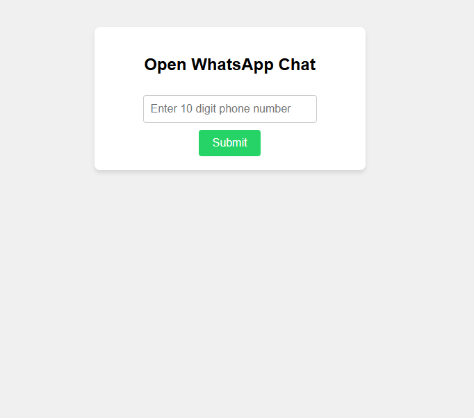

# WhatsApp Chat Opener

This simple web app allows users to quickly open a WhatsApp chat with any 10-digit indian phone number.
It is useful for sending messages to numbers not saved in your contacts.

## Features

- Clean, responsive UI
- Only accepts 10-digit numeric input (no letters or special characters)
- Opens WhatsApp chat in a new tab for the entered number
- Input is validated and sanitized in real-time

## How to Use

1. Open `index.html` in your web browser.
2. Enter a 10-digit phone number in the input box.
3. Click the **Submit** button.
4. A new tab will open with the WhatsApp chat for the entered number.

## Notes

- The input box only allows numbers and limits input to 10 digits.
- If you enter an invalid number, you will see an alert.
- The WhatsApp logo is used as the favicon for easy identification.

## Screenshot

---

**Made for quick WhatsApp messaging without saving
